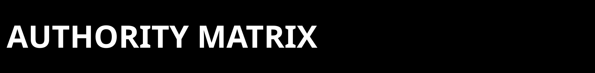
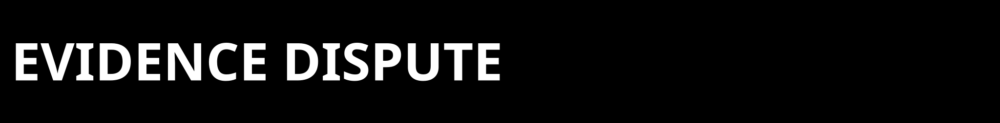

<p>
  
</p>

<p>
  
</p>

This is the shortest honest audit path for the current ZPE-Neuro repo surface.

It is not a blind-clone verification packet and it is not a substitute for the
top acceptance gate.

<p>
  
</p>

1. Clone the repo if you have authorized access:

```bash
git clone https://github.com/Zer0pa/ZPE-Neuro.git
cd ZPE-Neuro
```

2. Install the core package:

```bash
python3.11 -m venv .venv
source .venv/bin/activate
python -m pip install --upgrade pip
python -m pip install -e .
python -c "import zpe_neuro"
```

3. Run the shipped test slice:

```bash
python -m pip install -e '.[dev]'
python -m pytest tests
```

4. Replay the current shipped synthetic gate baseline:

```bash
python -m pip install -e '.[gate,dev]'
python tools/run_gate_c.py --artifact-root artifacts/audit_gate_c --seed 20260220
python tools/run_gate_d.py --artifact-root artifacts/audit_gate_d --replay-seeds 20260220,20260221,20260222,20260223,20260224
```

5. Read the current authority routing and proof packet:
- `proofs/manifests/CURRENT_AUTHORITY_PACKET.md`
- `proofs/selected_artifacts/2026-03-21_zpe_neuro_release_alignment/`
- `proofs/selected_artifacts/2026-03-21_zpe_neuro_ibl_refinement/`

6. Read the limit note before widening any claim:
- `PUBLIC_AUDIT_LIMITS.md`

<p>
  
</p>

| Anchor / artifact | Class | What it is for | What it is not for |
|---|---|---|---|
| `proofs/manifests/CURRENT_AUTHORITY_PACKET.md` | current routing anchor | tells you which packet is current and which are historical | direct proof by itself |
| `proofs/selected_artifacts/2026-03-21_zpe_neuro_release_alignment/` | current technical authority | March 21 package/install/gate alignment surface | blind-clone closure |
| `proofs/selected_artifacts/2026-03-21_zpe_neuro_ibl_refinement/` | current lane evidence authority | bounded local extracellular lane posture | public-release verdict |
| `CHANGELOG.md` and `runbooks/` | chronology only | how the current surface was reached | current proof authority |

<p>
  
</p>

Expected current truth:
- packaged baseline is clean only for the declared extras that remain in
  `pyproject.toml`
- current lane scope is extracellular
- DANDI `000034` is the strongest positive public anchor
- bounded local counted breadth is `PASS`
- blind-clone and commercialization remain `OPEN`

<p>
  
</p>

If your replay disagrees:
- keep the full command output
- keep the artifact root
- note whether you used the declared packaged surface or an operator-only path
- compare against `CURRENT_AUTHORITY_PACKET.md` before declaring a contradiction
