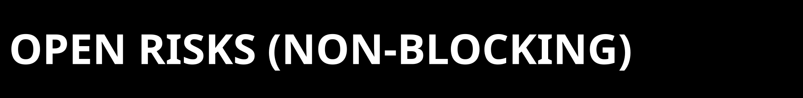

  

  

This file exists to stop over-reading the staged repo. Despite the filename, it
applies to any repo checkout of the current ZPE-Neuro surface, including the
private GitHub repo.

  

The repository now contains:
- the current code and docs surface
- a tracked March 21 release-alignment proof packet
- the March 21 bounded IBL refinement packet

It is the current repo authority surface. It is not the final blind-clone
verification authority surface.

  

Hard limits:
- no blind-clone verification has been completed from this repo
- no public-release readiness is implied
- the lane is still narrower than a general neural, human, or commercialization
  claim
- the proof corpus is curated, not exhaustive
- commercialization is not closed

  

| Limit | Current state | Why it matters |
|---|---|---|
| Blind-clone gap | still `OPEN` | The top acceptance gate remains unresolved even though the packaged baseline is clean. |
| Public vs operator split | IBL/Allen packaged extras are operator-only | A local operator path is not the same thing as a shipped install surface. |
| Lane scope | narrow extracellular recording lane only | AJILE12 is out-of-family and broader neural coverage is deferred. |
| Commercial boundary | Allen parity/commercialization still open | Technical progress does not erase legal/commercial open risk. |
| Current path residue | some tracked artifacts still keep machine-absolute paths in captured runtime traces | Traced evidence is not automatically portable replay instruction. |

  

Correct reading:
- use `proofs/manifests/CURRENT_AUTHORITY_PACKET.md` before widening any claim
- treat the March 21 IBL refinement packet as the current bounded local lane
  evidence surface
- treat `CHANGELOG.md` and `runbooks/` as chronology, not as current proof
  authority

Do not use this repo alone to claim:
- blind-clone portability
- public release readiness
- broad neural generalization beyond the extracellular lane
- commercialization clearance
