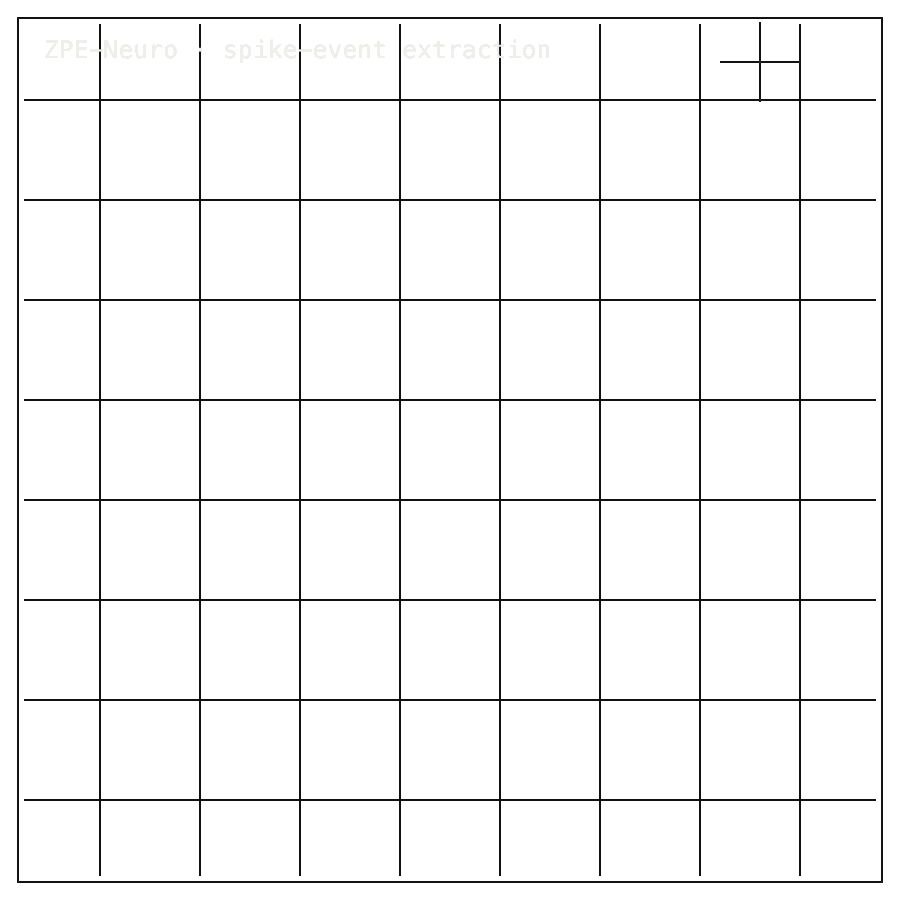

# ZPE-Neuro

## Install / Developer Commands

#### Quick Start

```bash
git clone https://github.com/Zer0pa/ZPE-Neuro.git
cd ZPE-Neuro
python3.11 -m venv .venv
source .venv/bin/activate
python -m pip install --upgrade pip
python -m pip install -e '.[dev]'
python -m pytest tests
```

For the bounded gate slice:

```bash
python -m pip install -e '.[gate,proof]'
python tools/run_gate_c.py --artifact-root artifacts/manual_gate_c --seed 20260220
python tools/run_gate_d.py --artifact-root artifacts/manual_gate_d --replay-seeds 20260220,20260221,20260222,20260223,20260224
```

<table width="100%">
<tr>
<td width="100%" valign="top">
<div><span><b>00 · ZPE-Neuro</b> · SPIKE-EVENT EXTRACTOR</span> <span>PR #52 DRAFT · PyPI 0.1.1</span></div>
      <h1>Event Horizons <span>of Neural Spikes</span></h1>
      <p>Extracellular spike-event codec · ZPE-Neuro · PyPI <em>zpe-neuro</em> v0.1.1 · github.com/Zer0pa/ZPE-Neuro</p>
      <p>A neuron fires when the voltage crosses a threshold &mdash; not before, not after. At that exact moment, a spike exists. Extracellular recordings catch millions of those crossings and return them as gigabytes of raw voltage. ZPE-Neuro works at the threshold: it extracts spike events on DANDI 000034 at <strong>481&times;</strong> event-ratio compression and <strong>74.44 &micro;V</strong> residual, then replays them bit-identical across five seeds. The window is bounded. The crossing is precise. Latency is a modeled cycle figure, not measured on silicon. Breadth beyond 000034 stays open.</p>
</td>
</tr>
</table>

<table width="100%">
<tr>
<td width="100%" valign="top">
<figure>
        <div></div>
        <figcaption><b>Scope:</b> DANDI 000034 declared window. Latency is modeled, not silicon-measured; no clinical or diagnostic claim.</figcaption>
      </figure>
</td>
</tr>
</table>

<table width="100%">
<tr>
<td width="100%" valign="top">
<div><b>01 · THE GAP</b> <span>BOUNDED EXTRACTION</span></div>
      <h2>Brain recordings come back as raw voltage. The spike events inside them have no standard archive.</h2>
</td>
</tr>
</table>

<table width="100%">
<tr>
<td width="100%" valign="top">
<div><b>02 · MARKETS</b> <span>ADJACENT FORECASTS</span></div>
      <div>
        <div>
          <div><span>Electrophysiology devices '30</span>  <span>$21.7B</span></div>
          <div><span>Electrophysiology devices '31</span>  <span>$33.6B</span></div>
          <div><span>Neurotechnology '30</span>  <span>$21.7B</span></div>
          <div><span>Wearable heart monitoring '30</span>  <span>$10.4B</span></div>
          <div><span>Cardiac monitoring devices '32</span>  <span>$31.6B</span></div>
        </div>
      </div>
      <div>Electrophysiology and neurotech are buying the recorders. The spike events those recorders produce still have no shared archive format. ZPE-Neuro is tested on DANDI 000034 only.</div>
</td>
</tr>
</table>

<table width="100%">
<tr>
<td width="100%" valign="top">
<div><b>03 · VALUE OF MARKET</b></div>
      <div>$33.6<span>B</span></div>
      <div>The 2031 electrophysiology market; <b>a spike-event codec is the unpriced layer beneath it.</b></div>
</td>
</tr>
</table>

<table width="100%">
<tr>
<td width="100%" valign="top">
<div><b>07 · KEY METRICS</b> <span>DANDI 000034 · EVENT EXTRACTION</span></div>
</td>
</tr>
</table>

<table width="100%">
<tr>
<td width="100%" valign="top">
<div><b>07.1 · EVENT RATIO</b></div>
      <div>481<span>&times;</span></div>
      <div>Window-scoped · <b>DANDI 000034 only</b></div>
</td>
</tr>
</table>

<table width="100%">
<tr>
<td width="100%" valign="top">
<div><b>07.2 · SPIKE RMSE</b></div>
      <div>74.44<span>&micro;V</span></div>
      <div>Voltage residual after replay · <b>DANDI 000034 window</b></div>
</td>
</tr>
</table>

<table width="100%">
<tr>
<td width="100%" valign="top">
<div><b>07.3 · SEEDS</b></div>
      <div>5 / 5</div>
      <div>Bit-identical event replay · <b>across five random seeds</b></div>
</td>
</tr>
</table>

<table width="100%">
<tr>
<td width="100%" valign="top">
<div><b>07.4 · CHECKS</b></div>
      <div>C &amp; D</div>
      <div>Residual and timing checks pass · <b>latency modeled, not silicon</b></div>
</td>
</tr>
</table>

<table width="100%">
<tr>
<td width="100%" valign="top">
<div><b>07.5 · RELEASE</b></div>
      <div>v0.1.1</div>
      <div>PyPI <b>STALE</b> · PR #52 draft</div>
</td>
</tr>
</table>

<table width="100%">
<tr>
<td width="100%" valign="top">
<div><b>08 · DETERMINISM</b> <span>5-SEED BIT-EXACT</span></div>
      <h2>Five random seeds, <span>five bit-identical spike-event streams.</span></h2>
</td>
</tr>
</table>

<table width="100%">
<tr>
<td width="66%" valign="top">
<div><b>08.1 · WHAT THE CHECKS MEASURE</b> <span>SCOPED CLAIM</span></div>
      <p>Deterministic means one narrow thing here. On DANDI 000034's declared window, the spike-event extractor emits bit-identical event streams across five random seeds &mdash; 5/5 SEEDS measures that. Extracted events are the threshold crossings; the voltage between them is gone. Latency is a modeled cycle figure at 80 MHz ARM-class clock, not measured on silicon. Check D modeled mean 612.5 ns, p99 850 ns, against a 900 ns proxy threshold. No on-silicon determinism claim follows.</p>
</td>
<td width="34%" valign="top">
<div><b>08.2 · THE FIDELITY GAP</b></div>
      <span>Honest Blocker &middot;</span>
      <p><strong>DANDI breadth MISS</strong>: 1 of 2 counted targets; DANDI 000003 ran and failed, IBL remains unclosed. Latency is hardware-proxy modeled, not silicon. PR #52 is draft, not on main. PyPI v0.1.1 is stale. README still carries a <em>private staged</em> badge. No clinical or diagnostic claim is made.</p>
</td>
</tr>
</table>

<table width="100%">
<tr>
<td width="33%" valign="top">
<div><b>09</b> </div>
      <h2>FIVE PATHS FROM ONE <span>SPIKE EVENT.</span></h2>
</td>
<td width="67%" valign="top">
<div><b>09.1 · THIS REPO'S AMBITION</b></div>
      <p>The aim is not a general neural decoder. It is one thing well: a threshold crossing that survives encode, compress, and replay unchanged. Applied across datasets, that discipline turns extracellular archives from raw voltage dumps into objects two labs can point at and mean the same event.</p>
</td>
</tr>
</table>

<table width="100%">
<tr>
<td width="33%" valign="top">
<div><b>09.2 · WHAT WORKS NOW</b> <span>EXTERNAL</span></div>
        <h2>Working today: 481&times; event extraction with 74.44 &micro;V residual and bit-identical replay on DANDI 000034.</h2>
</td>
<td width="67%" valign="top">
<div><b>09.3 · WHAT'S STILL OPEN</b> <span>EXTERNAL</span></div>
        <h2>Still open: DANDI 000003 failed, IBL breadth unclosed, latency unmeasured on silicon, release stale.</h2>
</td>
</tr>
</table>

<table width="100%">
<tr>
<td width="100%" valign="top">
<div><b>09.4</b> &middot; ARCHIVES · NEAR-TERM (12&ndash;24 MO)</div>
      <div>Labs keep full sessions, not samples</div><div>A lab that compresses a recording 481 times can keep entire sessions on the same disks that used to hold representative slices. The conversation about what to discard from a neural archive ends.</div>
</td>
</tr>
</table>

<table width="100%">
<tr>
<td width="100%" valign="top">
<div><b>09.5</b> &middot; PROBES · NEAR-TERM (12&ndash;24 MO)</div>
      <div>Spike packets fit a probe&rsquo;s timing budget</div><div>A modeled 850 ns p99 encode places this packet inside the time budget of a real electrode interface. A probe-firmware architect can plan around it now and validate on silicon later, rather than wait for both at once.</div>
</td>
</tr>
</table>

<table width="100%">
<tr>
<td width="100%" valign="top">
<div><b>09.6</b> &middot; CALIBRATION · MID-TERM (24&ndash;48 MO)</div>
      <div>Pass and fail across datasets calibrate the field</div><div>DANDI 000034 passes. DANDI 000003 failed. IBL is next. Each result, kept and named, tells a neuroscience research group exactly which kinds of extracellular recordings this codec covers and which it does not &mdash; before they commit budget.</div>
</td>
</tr>
</table>

<table width="100%">
<tr>
<td width="100%" valign="top">
<div><b>09.7</b> &middot; CROSS-DEVICE · MID-TERM (24&ndash;48 MO)</div>
      <div>One spike event reads the same everywhere</div><div>Five seeds already produce bit-identical replays on one machine. The next step is the same identity across different runtimes and hardware &mdash; the condition for a BCI platform to trust that a spike captured in one rig is the same object when a partner lab opens it.</div>
</td>
</tr>
</table>

<table width="100%">
<tr>
<td width="100%" valign="top">
<div><b>09.8</b> &middot; REPLICATION · PARADIGM (48 MO+)</div>
      <div>Neural archives acquire chain-of-custody</div><div>When a threshold crossing has a deterministic identity, two labs can point at the same spike across time, hardware, and protocol revisions. Replication in extracellular neuroscience starts to mean the same thing twice &mdash; not a similar plot, the same event.</div>
</td>
</tr>
</table>
