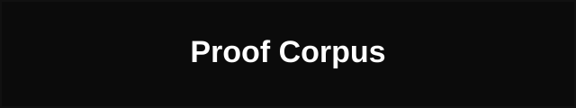
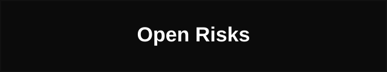
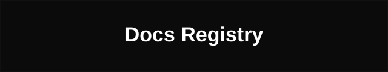

<h1 align="center">ZPE-Neuro</h1>

<p align="center">
  
</p>

<p align="center">
  <a href="LICENSE"></a>
  <a href="CONTRIBUTING.md"></a>
  <a href="proofs/manifests/CURRENT_AUTHORITY_PACKET.md"></a>
  <a href="RELEASING.md"></a>
  <a href="docs/LEGAL_BOUNDARIES.md"></a>
</p>
<p align="center">
  <a href="AUDITOR_PLAYBOOK.md"></a>
  <a href="docs/ARCHITECTURE.md"></a>
  <a href="PUBLIC_AUDIT_LIMITS.md"></a>
  <a href="docs/README.md"></a>
</p>

<table align="center" width="100%" cellpadding="0" cellspacing="0">
  <tr>
    <td width="25%"><a href="#what-this-is"></a></td>
    <td width="25%"><a href="#current-authority"></a></td>
    <td width="25%"><a href="#runtime-proof-wave-1"></a></td>
    <td width="25%"><a href="#quickstart-and-license"></a></td>
  </tr>
  <tr>
    <td width="25%"><a href="#proof-corpus"></a></td>
    <td width="25%"><a href="#open-risks"></a></td>
    <td width="25%"><a href="#go-next"></a></td>
    <td width="25%"><a href="docs/README.md"></a></td>
  </tr>
</table>

---

<p>
  
</p>

<a id="commercial-front-door"></a>
<a id="what-this-is"></a>
## What This Is

401× compression on extracellular neural recordings; every replay bit-identical. Anchored on DANDI 000034 with IBL second-target PASS.

ZPE-Neuro targets neurotech research-infrastructure teams and academic neuroscience platforms where non-deterministic compression pipelines make spike sorting, population decoding, and cross-session comparison irreproducible. This repo carries the Wave-1 neural signal package, curated proof corpus, and release-surface documentation. Scoped strictly to extracellular data — not broad neural generality.

AJILE12 out-of-family handling is explicitly documented rather than silently excluded. Unresolved blind-clone and commercialization gates remain open.

| Field | Value |
|-------|-------|
| Architecture | SPIKE_STREAM |
| Encoding | NEURO_DELTA_V1 |

## Key Metrics

| Metric | Value | Baseline |
|--------|-------|----------|
| DANDI_CR | 401.04× | — |
| IBL_CR | 224.30× | — |
| FIDELITY | 38.16 | µV |
| DETERMINISM | 2/2 | — |

> Source: [`public_corpus_eval_dandi_000034_mouse412804_ecephys.json`](proofs/selected_artifacts/2026-03-21_zpe_neuro_ibl_refinement/public_corpus_eval_dandi_000034_mouse412804_ecephys.json) | [`public_corpus_ibl_waveform_eval.json`](proofs/selected_artifacts/2026-03-21_zpe_neuro_ibl_refinement/public_corpus_ibl_waveform_eval.json)

## What We Prove

> Auditable guarantees backed by committed proof artifacts. Start at `AUDITOR_PLAYBOOK.md`.

- DANDI 000034 extracellular validation with deterministic round-trip fidelity
- IBL second-target PASS under bounded refinement conditions
- Both datasets are real public with auditable lineage
- AJILE12 out-of-family handling explicitly documented

## What We Don't Claim

- No claim of blind-clone verification
- No claim of commercialization-safe closure
- No claim of tagged release
- No claim beyond extracellular lane

<p>
  
</p>

<a id="current-authority"></a>
## Commercial Readiness

| Field | Value |
|-------|-------|
| Verdict | PRIVATE_STAGED |
| Commit SHA | da657d0e12a2 |
| Confidence | 100% |
| Source | proofs/manifests/CURRENT_AUTHORITY_PACKET.md |

> **Evaluators:** Available for qualified evaluation. `pip install -e .` in a clean venv. Contact hello@zer0pa.com.

### Authority Detail

| Field | Current truth | Authority |
|---|---|---|
| Authority snapshot date | `2026-03-21` | [proofs/manifests/CURRENT_AUTHORITY_PACKET.md](proofs/manifests/CURRENT_AUTHORITY_PACKET.md) |
| Repository / acquisition surface | Canonical GitHub repo: `https://github.com/Zer0pa/ZPE-Neuro` for authorized readers. Clone surface for authorized readers: `git clone https://github.com/Zer0pa/ZPE-Neuro.git`. | `AUDITOR_PLAYBOOK.md`, `docs/ARCHITECTURE.md` |
| Repo posture | `PRIVATE_STAGED`. Package, install, docs, and proof surfaces are aligned for the current repo state, but this is not a public release and not a clean-clone-closed authority packet. | `RELEASING.md`, `PUBLIC_AUDIT_LIMITS.md` |
| Top unresolved gate | A fresh clean-clone replay of the authority packet remains the top unresolved acceptance gate. | `RELEASING.md` |
| Gate status | `OPEN` for blind-clone and public-release gates. `PASS` for the current clean packaged baseline and the tracked release-alignment gate slice. | [proofs/selected_artifacts/2026-03-21_zpe_neuro_release_alignment/](proofs/selected_artifacts/2026-03-21_zpe_neuro_release_alignment/README.md) |
| Current lane / scope lock | Lane 1 is a narrow extracellular recording lane. AJILE12 is explicitly `OUT_OF_FAMILY` for the current codec; broader human or intracranial coverage is not claimed here. | `proofs/selected_artifacts/2026-03-21_zpe_neuro_ibl_refinement/public_corpus_summary.json` |
| Primary positive public anchor | DANDI `000034` remains the strongest positive public waveform anchor in the current repo surface. | `proofs/selected_artifacts/2026-03-21_zpe_neuro_ibl_refinement/public_corpus_summary.json` |
| Counted breadth verdict | `PASS` in the current bounded local evidence packet after the March 21 IBL refinement. This does not upgrade blind-clone status or broader release claims. | `proofs/selected_artifacts/2026-03-21_zpe_neuro_ibl_refinement/public_corpus_summary.json` |
| Family-boundary decision | `OUT_OF_FAMILY` for AJILE12 in the current lane. | `proofs/selected_artifacts/2026-03-21_zpe_neuro_ibl_refinement/public_corpus_summary.json` |
| Packaged clean baseline | `PASS` for the packaged `.`, `.[gate]`, `.[public]`, and `.[proof]` surfaces that are actually declared for clean install/import. IBL chunked-waveform tooling and Allen parity remain operator-only. | `proofs/selected_artifacts/2026-03-21_zpe_neuro_release_alignment/verification_summary.md`, `pyproject.toml`, `docs/ARCHITECTURE.md` |
| Blind-clone verification status | `OPEN` | `PUBLIC_AUDIT_LIMITS.md`, `RELEASING.md` |
| Release status | `NO_PUBLIC_RELEASE`. The current repo surface is documented and internally coherent, but no public-release verdict is claimed. | `RELEASING.md` |
| Commercialization status | `OPEN`. Allen parity and commercialization closure remain unresolved. | `docs/LEGAL_BOUNDARIES.md`, `RELEASING.md` |
| Primary authority artifacts | `proofs/manifests/CURRENT_AUTHORITY_PACKET.md`, `proofs/selected_artifacts/2026-03-21_zpe_neuro_release_alignment/`, `proofs/selected_artifacts/2026-03-21_zpe_neuro_ibl_refinement/` | `proofs/README.md` |
| Audit route | Start with the short replay path, then read the limits note before widening any claim. | `AUDITOR_PLAYBOOK.md`, `PUBLIC_AUDIT_LIMITS.md` |

<p align="center">
  
</p>

<p>
  
</p>

<a id="runtime-proof-wave-1"></a>
## Tests and Verification

| Code | Check | Verdict |
|------|-------|---------|
| V_01 | DANDI 000034 public anchor | PASS |
| V_02 | IBL second-target bounded refinement | PASS |
| V_03 | AJILE12 family boundary memo | PASS |
| V_04 | Breadth adjudication summary | PASS |
| V_05 | Release-alignment Gate C summary | PASS |
| V_06 | Release-alignment Gate D summary | PASS |
| V_07 | Blind-clone authority replay | INC |

### Runtime Proof And Package Truth

| Surface | Current state | Why it matters |
|---|---|---|
| Core package build/import | `PASS` | The repo now ships a truthful Python package surface rather than relying on undeclared runtime assumptions. |
| Repo-local tests | `PASS` on the current shipped unit slice | The staged code surface has a small but real regression check that ships with the repo. |
| Synthetic gate baseline | `PASS` for sequential Gate C and Gate D replay in the current clean packaged gate stack | This is the strongest current shipped replay baseline in the repo. |
| Public replay import surface | `PASS` for the declared `.[proof]` import stack | This keeps the docs honest about what the packaged replay stack actually installs cleanly. |
| IBL and Allen operator paths | `OPERATOR_ONLY` | Those paths currently require manual dependency or toolchain work around `ONE-api`, `ibl-neuropixel`, `llvmlite` or `numba`, or `allensdk` conflicts and are intentionally not shipped as clean extras. |
| Release automation | `PASS` for static verification coverage | The repo now has a verification workflow that checks package, build, and install truth without implying a live publish pipeline or automated publish step. |

<p>
  
</p>

## Proof Anchors

| Path | State |
|------|-------|
| proofs/manifests/CURRENT_AUTHORITY_PACKET.md | VERIFIED |
| proofs/selected_artifacts/2026-03-21_zpe_neuro_release_alignment/verification_summary.md | VERIFIED |
| proofs/selected_artifacts/2026-03-21_zpe_neuro_release_alignment/gate_c_summary.json | VERIFIED |
| proofs/selected_artifacts/2026-03-21_zpe_neuro_release_alignment/gate_d_summary.json | VERIFIED |
| proofs/selected_artifacts/2026-03-21_zpe_neuro_ibl_refinement/public_corpus_eval_dandi_000034_mouse412804_ecephys.json | VERIFIED |
| proofs/selected_artifacts/2026-03-21_zpe_neuro_ibl_refinement/public_corpus_ibl_waveform_eval.json | VERIFIED |
| proofs/selected_artifacts/2026-03-21_zpe_neuro_ibl_refinement/ajile12_family_boundary_decision.md | VERIFIED |

## Repo Shape

| Field | Value |
|-------|-------|
| Proof Anchors | 7 |
| Modality Lanes | 1 |
| Authority Source | proofs/manifests/CURRENT_AUTHORITY_PACKET.md |

<a id="proof-corpus"></a>
### Proof Corpus

| Packet | Class | How to read it |
|---|---|---|
| [proofs/manifests/CURRENT_AUTHORITY_PACKET.md](proofs/manifests/CURRENT_AUTHORITY_PACKET.md) | `CURRENT` | The routing manifest for what is current, what is historical, and which packet owns each claim layer. |
| [proofs/selected_artifacts/2026-03-21_zpe_neuro_release_alignment/](proofs/selected_artifacts/2026-03-21_zpe_neuro_release_alignment/README.md) | `CURRENT` | Tracked summaries for the March 21 release-alignment technical pass. |
| [proofs/selected_artifacts/2026-03-21_zpe_neuro_ibl_refinement/](proofs/selected_artifacts/2026-03-21_zpe_neuro_ibl_refinement/README.md) | `CURRENT` | Current bounded local extracellular breadth packet, including the counted IBL second-target `PASS`. |
| [CHANGELOG.md](CHANGELOG.md) and [runbooks/README.md](runbooks/README.md) | `SUPPORTING` | Chronology, receipts, and operational history. Use them to understand how the current repo state was reached, not as current proof authority. |

<p>
  
</p>

<a id="open-risks"></a>
### Open Risks

| Surface | Class | Current truth |
|---|---|---|
| Blind-clone authority pack | `OPEN` | The repo does not yet prove a fresh blind-clone authority replay. |
| Public release | `OPEN` | No tagged or public release readiness is claimed from this repo state. |
| IBL / Allen operator paths | `OPERATOR_ONLY` | These remain outside the clean packaged release surface because the upstream dependency chains are not currently truthful for a clean install. |
| Commercialization closure | `OPEN` | Allen parity and commercialization-safe closure remain unresolved. |
| Broader neural scope | `PARKED_BY_SCOPE` | Broader human or intracranial coverage is outside the current lane. |
| Historical path residue | `KNOWN_RESIDUE` | Some tracked runtime artifacts still contain machine-absolute paths inside captured traces. They are evidence lineage, not current filesystem instructions. |

<p>
  
</p>

<a id="quickstart-and-license"></a>
## Quick Start

Acquire from the private GitHub repo if you have authorized access, then verify the shipped package surface from a checkout.

```bash
git clone https://github.com/Zer0pa/ZPE-Neuro.git
cd ZPE-Neuro

python3.11 -m venv .venv
source .venv/bin/activate
python -m pip install --upgrade pip
python -m pip install -e .
python -c "import zpe_neuro"
```

Repo-local test slice:

```bash
python -m pip install -e '.[dev]'
python -m pytest tests
```

Repo-local synthetic gate slice:

```bash
python -m pip install -e '.[gate,dev]'
python tools/run_gate_c.py --artifact-root artifacts/manual_gate_c --seed 20260220
python tools/run_gate_d.py --artifact-root artifacts/manual_gate_d --replay-seeds 20260220,20260221,20260222,20260223,20260224
```

Repo-local clean public replay import surface:

```bash
python -m pip install -e '.[proof]'
```

The `tools/` runners are repo-local scripts, not installed console entry points. `LICENSE` is the legal source of truth. Read `docs/LEGAL_BOUNDARIES.md` before turning any repo result into a wider legal or commercial claim.

<p align="center">
  
</p>

<p>
  
</p>

## Ecosystem

| Surface | Link | Role |
|---|---|---|
| Zer0pa portfolio namespace | [github.com/Zer0pa](https://github.com/Zer0pa) | Parent portfolio namespace for the workstream |
| ZPE-IMC reference repo | [github.com/Zer0pa/ZPE-IMC](https://github.com/Zer0pa/ZPE-IMC) | Shared docs and README reference line for structure and quality, not for inherited proof claims |
| Proof surface registry | [proofs/README.md](proofs/README.md) | Canonical proof surface entry points for this repo |
| Reproducing guide | [REPRODUCING.md](REPRODUCING.md) | Offline verify, public DANDI download, and benchmark replay commands for this repo |
| Open dataset surfaces | [docs/OPEN_DATASET_SURFACES.md](docs/OPEN_DATASET_SURFACES.md) | Verified next-step public breadth targets without widening the current extracellular lane claim |
| KiloSort4 operator note | [docs/KILOSORT4.md](docs/KILOSORT4.md) | Benchmark-only comparator guidance and current operator install posture |

**Observability:** [Comet dashboard](https://www.comet.com/zer0pa/zpe-neuro/view/new/panels) (public)

## Who This Is For

| | |
|---|---|
| **Ideal first buyer** | Neurotech research-infrastructure team or academic neuroscience platform needing deterministic signal encoding with proof lineage |
| **Pain** | Neural recording pipelines lack reproducibility guarantees — re-analyses produce different outputs across environments, eroding audit trust |
| **Deployment** | Python package (`pip install -e .`), private staged. Not currently distributed as a public package |
| **Family position** | Validates ZPE encoding generality to neural signal domains. Staged/validation tier alongside Mocap, Prosody, and Bio |

<a id="go-next"></a>
### Where To Go

| Need | Start here |
|---|---|
| Shortest honest audit path | `AUDITOR_PLAYBOOK.md` |
| Current authority routing | `proofs/manifests/CURRENT_AUTHORITY_PACKET.md` |
| Architecture and package boundaries | `docs/ARCHITECTURE.md` |
| Limits and caveats | `PUBLIC_AUDIT_LIMITS.md`, `docs/LEGAL_BOUNDARIES.md` |
| Release gate | `RELEASING.md` |
| Support and contact routing | `docs/SUPPORT.md` |
| Canonical doc registry | `docs/README.md` |
