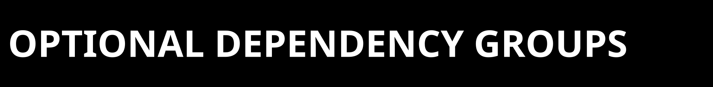

  

  

This document is the canonical architecture index for the current ZPE-Neuro
repo surface. It defines where package truth, proof truth, and release truth
live.

Canonical anchors:
- Repository: `https://github.com/Zer0pa/ZPE-Neuro`
- Contact: `architects@zer0pa.ai`
- Current authority routing: `proofs/manifests/CURRENT_AUTHORITY_PACKET.md`
- Current technical proof packet: `proofs/selected_artifacts/2026-03-21_zpe_neuro_release_alignment/`
- Current lane evidence packet: `proofs/selected_artifacts/2026-03-21_zpe_neuro_ibl_refinement/`

  

| Surface | Role | Canonical path |
|---|---|---|
| Package metadata | install and dependency truth | `pyproject.toml` |
| Package code | import surface and gate logic | `src/zpe_neuro/` |
| Tests | shipped regression slice | `tests/` |
| Repo-local runners | gate, replay, and validation scripts | `tools/` |
| Docs | front door, release, governance, support | `README.md`, `docs/` |
| Runbooks | operational lane/run receipts and instructions | `runbooks/` |
| Proof corpus | tracked current and historical authority packets | `proofs/` |

  

| Install surface | Current truth | Notes |
|---|---|---|
| `pip install -e .` | clean packaged baseline | core package only |
| `pip install -e '.[dev]'` | shipped test slice | unit tests only |
| `pip install -e '.[gate,dev]'` | shipped synthetic gate baseline | current strongest clean packaged replay path |
| `pip install -e '.[public]'` | clean public replay dependency surface | DANDI/AJILE stack only |
| `pip install -e '.[proof]'` | alias of the current clean public replay stack | import/replay helper surface |

The `tools/` runners are repo-local scripts. No installed console entry point
is claimed.

  

| Packet | Class | What it owns |
|---|---|---|
| `proofs/manifests/CURRENT_AUTHORITY_PACKET.md` | current routing anchor | current versus historical packet ownership |
| `proofs/selected_artifacts/2026-03-21_zpe_neuro_release_alignment/` | current technical authority | package/install/gate alignment summaries |
| `proofs/selected_artifacts/2026-03-21_zpe_neuro_ibl_refinement/` | current lane evidence authority | bounded local extracellular breadth and current machine-readable lane verdict |
| `proofs/selected_artifacts/2026-03-21_zpe_neuro_lane1_wedge_decision/` | supporting boundary note | why the lane remains extracellular |
| `proofs/selected_artifacts/2026-02-21_zpe_neuro_wave1_closure_push_adjudicated/` | historical-only | adjudicated closure lineage and commercial-risk history |

  

| Surface | Why it is operator-only today |
|---|---|
| IBL chunked-waveform tooling | depends on manual setup around `ONE-api`, `ibl-neuropixel`, and the upstream `llvmlite` / `numba` toolchain |
| Allen parity | depends on `allensdk`, which conflicts with `numpy>=1.26` |
| Ignored local `artifacts/` tree | useful for reruns, but not a shipped GitHub proof anchor until promoted into `proofs/selected_artifacts/` |

  

Known lagging defaults:
- the default breadth-adjudication code still points at a pre-refinement fail
  bundle, so the front door routes through `CURRENT_AUTHORITY_PACKET.md`
  instead
- some historical prose packets still speak in pre-refinement fail-forward
  language

The docs resolve this by making the later March 21 bounded refinement packet
the current lane-evidence surface while keeping the older packets visible as
history.
