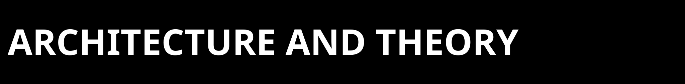
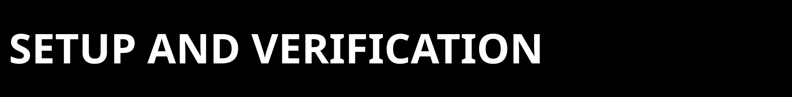

<p>
  
</p>

Organized for first-contact readers. If your question is not answered here,
see `docs/SUPPORT.md` or `AUDITOR_PLAYBOOK.md`.

---

<p>
  
</p>

**What is ZPE-Neuro today?**

ZPE-Neuro is a private staged repo for the `zpe_neuro` package, the current
Neuro proof corpus, and the release-surface documentation for the workstream.
It is not a public release, not a clean-clone-closed authority packet, and not
a commercialization-clear product surface.

---

**What is the current strongest authority artifact?**

Use `proofs/manifests/CURRENT_AUTHORITY_PACKET.md` first. The current technical
release-alignment packet is
`proofs/selected_artifacts/2026-03-21_zpe_neuro_release_alignment/`. The
current bounded local lane-evidence packet is
`proofs/selected_artifacts/2026-03-21_zpe_neuro_ibl_refinement/`.

---

**Why are older February and March bridge packets not the front-door authority anymore?**

Because the live proof surface was collapsed onto the self-contained March 21
release-alignment and IBL-refinement packets. Older bridge material now lives
only as chronology in [CHANGELOG.md](../CHANGELOG.md) and
[runbooks/README.md](../runbooks/README.md).

---

**What is historical-only?**

Older receipts and runbooks in `runbooks/` are chronology only. They explain
how the current repo state was reached, but they are not the live proof
surface.

---

**What is the current lane boundary?**

It is a narrow extracellular recording lane. DANDI `000034` is the strongest
positive public anchor in the current repo surface. AJILE12 is explicitly
out-of-family for the current lane. Broader
human/intracranial coverage is not claimed here.

---

**Does counted breadth `PASS` mean public release?**

No. The current bounded local IBL refinement packet gives a counted second
extracellular target `PASS` within scope. Blind-clone verification, public
release, and commercialization remain open.

---

**Why are IBL and Allen not clean packaged extras?**

Because the current truthful packaged surface is narrower than the full local
operator toolchain. IBL chunked-waveform work currently depends on manual setup
around `ONE-api`, `ibl-neuropixel`, and the upstream `llvmlite`/`numba` chain.
Allen parity currently conflicts with the package floor `numpy>=1.26` through
`allensdk`.

---

**Why doesn't the default breadth-adjudication code define the front door?**

It now points at the current March 21 IBL refinement packet. The docs still
route through `CURRENT_AUTHORITY_PACKET.md` so readers can see the current
proof ownership and the chronology boundary before widening any claim.

---

<p>
  
</p>

**How do I install and verify the current shipped surface?**

Use the private GitHub clone path only if you are an authorized repo reader.

```bash
git clone https://github.com/Zer0pa/ZPE-Neuro.git
cd ZPE-Neuro

python3.11 -m venv .venv
source .venv/bin/activate
python -m pip install --upgrade pip
python -m pip install -e .
python -c "import zpe_neuro"
python -m pip install -e '.[dev]'
python -m pytest tests
```

For the current shipped synthetic gate baseline:

```bash
python -m pip install -e '.[gate,dev]'
python tools/run_gate_c.py --artifact-root artifacts/manual_gate_c --seed 20260220
python tools/run_gate_d.py --artifact-root artifacts/manual_gate_d --replay-seeds 20260220,20260221,20260222,20260223,20260224
```

---

**What should I not claim from this repo alone?**

Do not claim:
- blind-clone portability
- public release readiness
- broad neural generalization beyond the extracellular lane
- commercialization clearance
