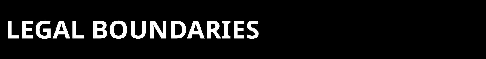
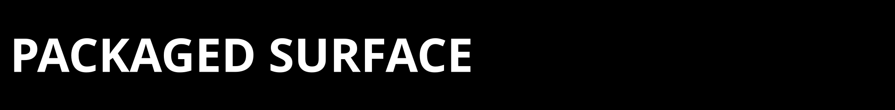
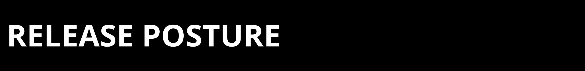

  

  

This note is a repo-surface summary only. `LICENSE` at the repository root is
the legal source of truth.

Canonical anchors:
- Repository: GitHub repo `https://github.com/Zer0pa/ZPE-Neuro`
- Contact: `architects@zer0pa.ai`

  

Package boundary:
- `pyproject.toml` defines the shipped install surfaces
- `src/zpe_neuro/` is the installed package code
- `tests/`, `tools/`, `artifacts/`, and `proofs/` are repo materials, not
  installed runtime packages
- the repo does not claim installed console scripts

  

Corpus and comparator boundary:
- DANDI/AJILE replay dependencies are part of the declared clean public replay
  stack
- IBL chunked probes remain a repo-local operator path
- Allen parity remains a repo-local operator path
- Kilosort4 remains benchmark-only
- Allen parity/commercialization closure remains open

No doc in this repo should turn those operator-only or open-risk surfaces into
clean packaged or commercialization-clear claims.

  

Historical evidence boundary:
- preserved historical proof files can retain machine-specific paths
- those strings are evidence lineage, not current instructions
- February 21 and early March bridge packets remain important, but they are not
  automatically the current authority surface

  

ZPE-Neuro follows an always-in-beta posture: the repo is useful now for bounded
extracellular replay and audit work, and it may improve materially as the codec
and proof surface advance. Blind-clone authority replay and commercialization
clearance remain separate open gates.
